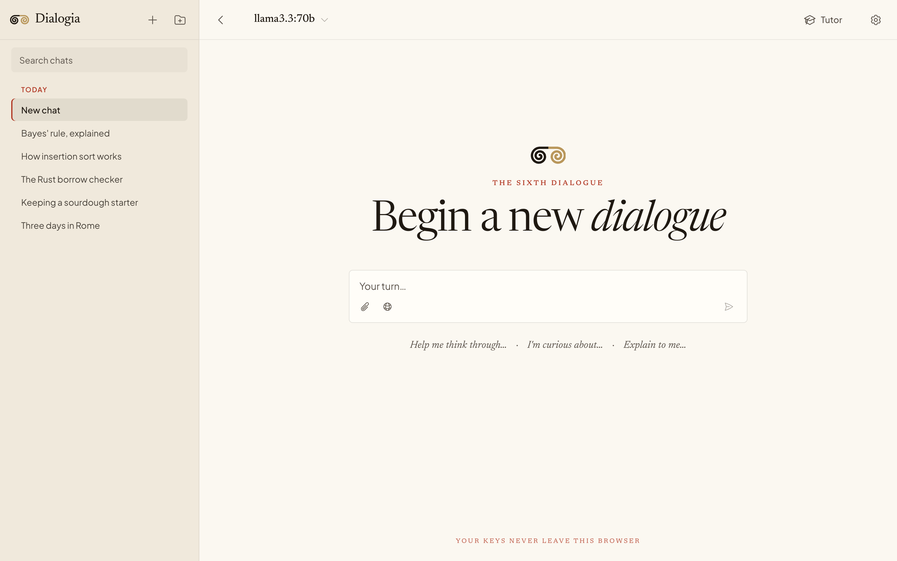
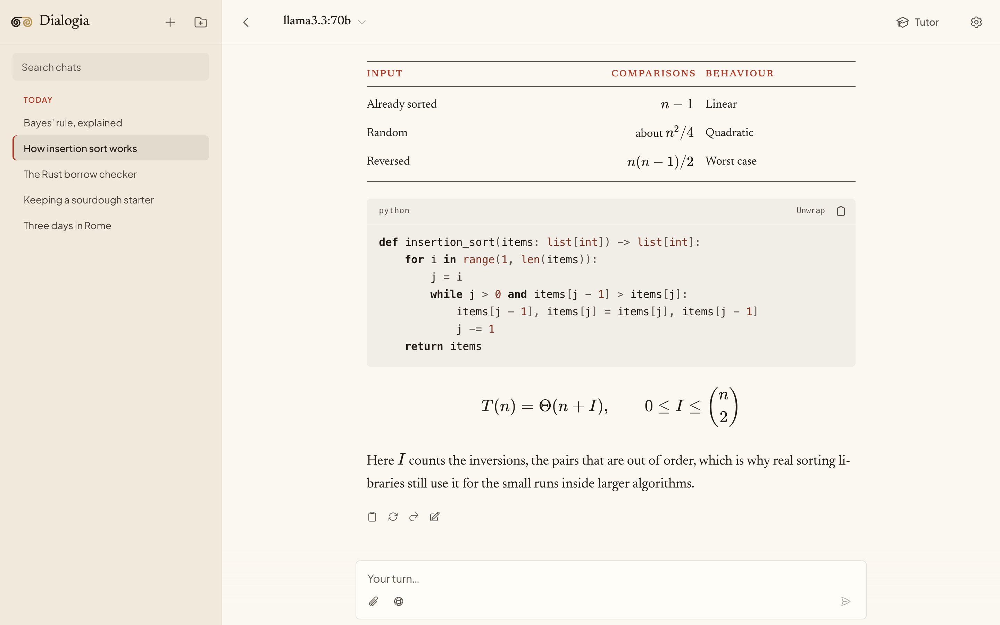
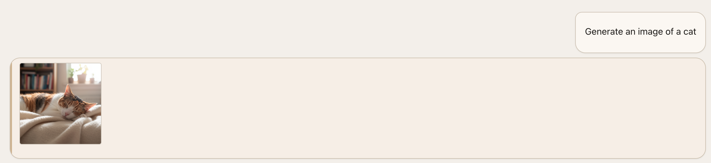
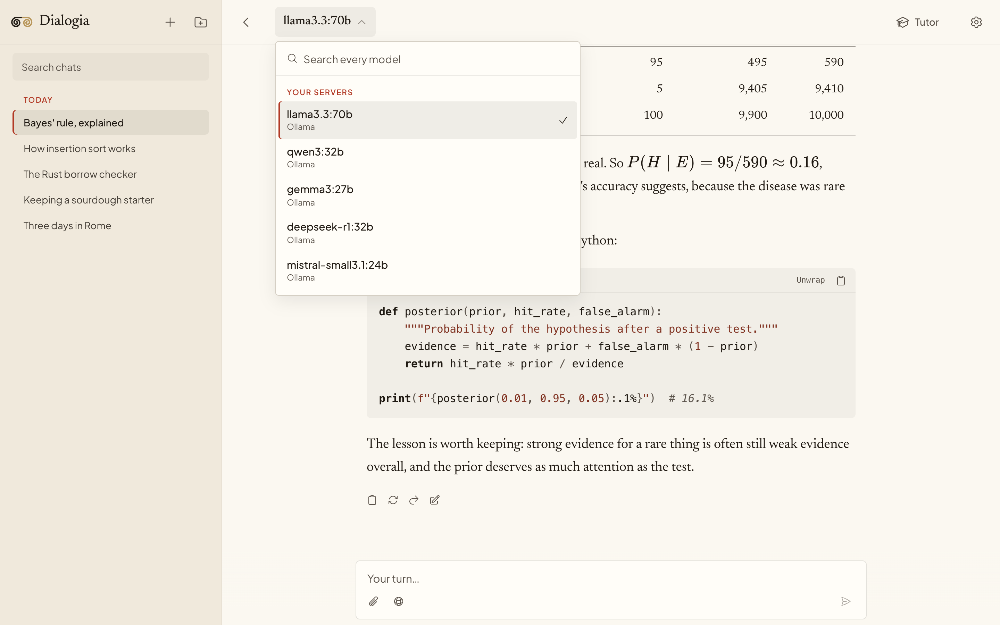
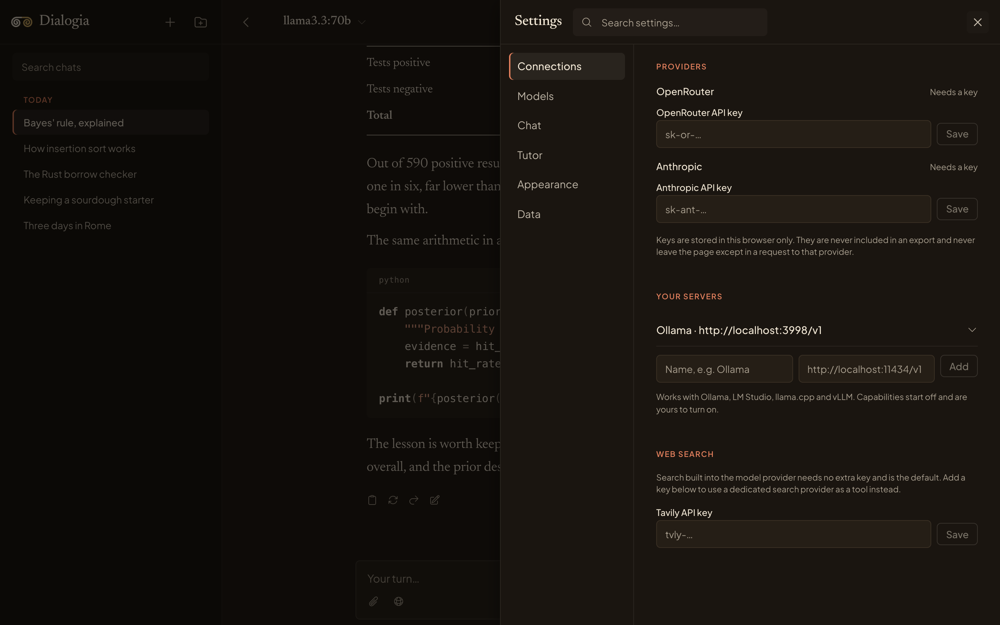

### Dialogia

Local-first, privacy-focused multi-model chat UI for OpenRouter and beyond.

### Highlights

- Local storage: Chats, messages, folders persisted in-browser via IndexedDB (Dexie).
- ZDR-ready: Optional Zero Data Retention filtering and enforcement; toggleable.
- Model control: Curated picker, favorites, hide-from-dropdown, custom IDs, and provider labels.
- Rich I/O: Images (vision), audio input (mp3/wav), PDFs; image generation output supported.
- Reasoning: Optional “thinking” stream for reasoning-capable models with effort control.
- Streaming + metrics: TTFT, token counts, tokens/sec; basic cost estimate when pricing is known.
- Compare drawer: Run one prompt across multiple models; copy, insert to chat, or switch model.
- Web search: Optional Brave Search or OpenRouter web plugin augmentation for grounded answers.

### Screenshots











### Setup

Copy `.env.example` to `.env.local` and fill in the values you need. `.env.example` is the
authoritative list of supported environment variables.

Recommended proxy mode (keeps keys on the server):

```
NEXT_PUBLIC_USE_OR_PROXY=true
OPENROUTER_API_KEY=sk-or-v1_your_server_key_here
```

Private access gate (optional but recommended when sharing preview):

```
AUTH_COOKIE_SECRET=replace-with-strong-random-hex
ACCESS_CODE_PEPPER=replace-with-strong-random-hex
ACCESS_CODES_INDIVIDUAL_HASHED=
ACCESS_CODES_DEVELOPER_HASHED=
```

Client-side mode (not recommended):

```
NEXT_PUBLIC_OPENROUTER_API_KEY=sk-or-v1_your_client_key_here
```

Install dependencies:

```
bun install
```

### Run

- Dev server: `bun run dev` → http://localhost:3000
- Build: `bun run build`
- Start (prod): `bun start`
- Lint: `bun run lint` (uses `eslint.config.js`)
- Type check: `bun run lint:types`
- Tests: `bun run test`
- Format: `bun run format`
- CI (type-check + tests + format check + lint): `bun run check`

Wrappers and helpers:

- Shell wrappers: `scripts/dev.sh`, `scripts/build.sh`, `scripts/start.sh`
- CI + hygiene: `scripts/install.sh`, `scripts/ci.sh`, `scripts/hygiene.sh`
- Eval runners: `scripts/tutor-sim.ts`, `scripts/run-ablation.ts`, `scripts/eval-tutor.ts`

### Key concepts and entrypoints

- Golden path: `docs/GOLDEN_PATH.md`
- Architecture boundaries: `ARCHITECTURE.md`
- State and persistence: `STATE_PERSISTENCE.md`
- Tutor tool contract: `TUTOR_TOOL_CONTRACT.md`

### How to style

See `docs/DESIGN.md` for the design system and guidance on where styles live.

### Local Artifacts

The following are local-only (already in `.gitignore`) and should not be committed: `.next/`,
`node_modules/`, `.eslintcache`, `.DS_Store`, `tmp/`, `tsconfig.tsbuildinfo`.

### Usage

- Pick a model in the top header. Favorites and hide actions personalize the list.
- Compose and send with Enter; Shift+Enter inserts a newline.
- Attachments:
  - Images: shown inline when the model supports vision.
  - Audio (mp3/wav): sent as input_audio content to audio-capable models.
  - PDFs: text is extracted client-side and sent as text blocks; small files may fall back to file
    blocks.
- Reasoning: toggle effort in the composer for thinking models; view “Thinking” panel per message.
- Web search: toggle the search icon to ground the next reply with sources. Brave runs locally when enabled; otherwise the OpenRouter web plugin is attached.
- DeepResearch: when search is enabled on a reasoning-capable OpenRouter model (and tutor mode is off), the next turn runs the multi-step research flow. Results appear as an assistant message with a sources panel.
- Compare: click the grid icon in the header to run a prompt across multiple models and review metrics.
- Slash commands:
  - `/model <id|name>` — set the model.
  - `/search on|off|toggle` — toggle Brave web search.
  - `/reasoning none|low|medium|high` — set reasoning effort.
  - `/help` — list supported commands.

### Headless Tutor Simulation

Run the complete tutoring pipeline (tutor agent, simulated learner, and LLM judge) without the UI:

```
bun run tutor:simulate -- --goal "Limits revision"
```

Key details:

- **API keys**: The runner talks directly to model APIs. Set `OPENROUTER_API_KEY` for the simulated student/judge/tutor models. Override with `--openrouter-key` if needed. Proxy-only setups are not supported for the headless flow.
- **Env loading**: The script now reads `.env.local` (and `.env`) on startup, so keys placed there are picked up automatically without passing CLI flags.
- **Defaults**: Uses the curated defaults from `src/data/curatedModels.ts` (tutor = `DEFAULT_TUTOR_MODEL_ID`, student/judge = `DEFAULT_MODEL_ID`). Override via `--tutor-model`, `--student-model`, and `--judge-model`.
- **Presets**: Run `bun run tutor:simulate -- --list-presets` to view canned scenarios (e.g. `--preset python_basics` runs a five-turn Python onboarding flow). You can still provide `--goal` manually to craft new scenarios.
- **Output**: Shows a concise turn-by-turn summary in the terminal and writes the full JSON payload (transcripts, tool calls, tutor UI, learner model snapshots, judge verdict) to `tmp/tutor-sim-*.json`. Override the destination with `--json-out path/to/report.json`.
- **Customizing**: Pass `--turns <n>` to limit the dialogue length, provide `--initial-user` to seed the first learner utterance, or supply different model IDs per role.
- **Testing**: The orchestration layer is covered by `tests/headlessSession.test.ts`. Run with `bun run test` once your environment allows TSX to spawn its IPC socket (some sandboxes may block this by default).

### Tutor Mode: Adaptive Learning Plans

Dialogia includes an experimental **Tutor Mode** that provides personalized, structured learning experiences with automatic progress tracking.

#### Features

- **Automatic Plan Generation**: Start a chat with a learning goal (e.g., "I want to learn Python basics"), and the tutor automatically generates a structured learning plan with topics, prerequisites, and learning objectives.
- **Mastery Tracking**: The system continuously monitors your understanding through conversation, tracking confidence levels (0-100%) for each topic based on your responses, questions, and demonstrated knowledge.
- **Adaptive Progression**: The tutor automatically advances you to the next topic when you reach 70% mastery, have completed 5+ interactions, and show no unresolved misconceptions.
- **Visual Progress**: View your learning plan and progress in real-time through the plan sidebar, with color-coded indicators showing completed, in-progress, and upcoming topics.

#### How to Use

1. **Enable Tutor Mode**: Click the "Tutor" button in the top header to activate tutor mode for the current chat (or for the next new chat if no chat is open).

2. **Start Learning**: Begin a conversation with your learning goal, for example:
   - "I want to learn React hooks"
   - "Teach me linear algebra fundamentals"
   - "Help me understand how Docker works"
   - "I need to learn SQL for data analysis"

3. **View Your Plan**: Once the plan is generated, you'll see:
   - A **progress indicator** in the header showing your completion percentage
   - The **current focus topic** highlighted in the header and composer
   - A **"View Plan" button** to open the full learning plan sidebar

4. **Track Your Progress**: As you learn:
   - Your mastery level for each topic is displayed in **assistant messages** after key interactions
   - **Status changes** (topic completion, transitions) appear as notifications in messages
   - The **plan sidebar** updates in real-time with your current mastery levels
   - Topics automatically unlock as you complete prerequisites

5. **Navigate Your Plan**: Click "View Plan" to:
   - See all topics in your learning path
   - View prerequisites and dependencies
   - Check your mastery level for each topic (with progress bars)
   - Manually advance or revisit topics if needed
   - See estimated completion time and difficulty

#### Example Learning Goals

Tutor mode works best with structured, skill-based learning goals:

**Programming Languages:**

- "I want to learn Python basics"
- "Teach me JavaScript ES6+ features"
- "Help me understand TypeScript type system"

**Frameworks & Tools:**

- "I need to learn React for web development"
- "Teach me Docker containerization"
- "Help me understand Git workflows"

**Concepts & Theory:**

- "I want to learn linear algebra"
- "Teach me database normalization"
- "Help me understand machine learning fundamentals"

**Professional Skills:**

- "I need to learn SQL for data analysis"
- "Teach me REST API design principles"
- "Help me understand system design concepts"

#### Understanding the Learner Model

The tutor tracks your mastery using a Bayesian confidence model:

- **Starting confidence**: 30% (beginner level)
- **Evidence weights**: -0.5 (misconception) to +0.5 (clear understanding)
- **Completion threshold**: 70% confidence, 5+ interactions, no unresolved misconceptions
- **Update frequency**: Learner model updates every 3 interactions by default

Progress indicators use color coding:

- 🟢 **Green (70-100%)**: Strong mastery, ready to advance
- 🟡 **Yellow (40-69%)**: Developing understanding, keep practicing
- 🔴 **Red (0-39%)**: Needs more work, concepts not yet clear

#### Tips for Effective Learning

- **Be specific** with your learning goals — the more focused, the better the plan
- **Ask questions** when you don't understand — the tutor tracks misconceptions
- **Demonstrate understanding** by explaining concepts back or solving problems
- **Review the plan** regularly to see your overall progress and upcoming topics
- **Take your time** — mastery is based on understanding, not speed

#### Limitations & Known Issues

- Plan generation requires a capable model (GPT-4, Claude, etc.)
- Very broad goals (e.g., "teach me everything") may produce less structured plans
- Mastery tracking is based on conversational evidence, not formal assessments
- Manual topic advancement is available but may skip important prerequisites

### Architecture

- Framework: Next.js App Router (React 18)
- State: Zustand with local persistence; Dexie for IndexedDB tables
- API proxy: `/api/openrouter/*` for models/completions; `/api/brave` for web search; `/api/xai/session` for X.AI voice
- Markdown: `react-markdown` + GFM, Prism, KaTeX, Mermaid
- Styles: Tailwind v4 base + `styles/foundations.css` tokens; `app/globals.css` layout
- Agent services: `src/lib/agent/request.ts` (request building), `src/lib/search/*` (search orchestration), and `src/lib/agent/tutorFlow.ts` (tutor memory composition) centralize turn logic.
- DeepResearch: `src/lib/deep-research/server/*` runs the server engine and tool adapters; `src/lib/deep-research/client/*` handles client orchestration.
- Capabilities: Derived from OpenRouter model metadata (vision, audio input, image output, reasoning)
- PDFs: Text is extracted client-side and preferred in prompts; small files may be sent as file blocks.

Security notes:

- Prefer proxy mode (`NEXT_PUBLIC_USE_OR_PROXY=true`) to keep provider keys server-side.
- Avoid placing secrets in `NEXT_PUBLIC_*` env vars when possible.
- Brave Search runs only server-side and requires `BRAVE_SEARCH_API_KEY`.
- ZDR-only: Opt-in via Settings or `NEXT_PUBLIC_OR_ZDR_ONLY_DEFAULT=true`.
- Access gate: Middleware validates a signed, HttpOnly cookie on every request; unauthenticated users are redirected to `/access`. Add env vars above and distribute plaintext codes privately.

### Deploying on Vercel

- Create a release branch (e.g., `release`) and point your Vercel project’s Production Branch to it.
- Add the env vars from Setup to the Vercel project (Production). Redeploy.
- No client-side keys required; all model calls run through `/api/openrouter/*` with the server-side key.

### Project Structure

```
app/                    # Next.js App Router entry (layout, page, globals)
src/components/         # React components (PascalCase .tsx)
src/components/message/ # Message subcomponents (meta, reasoning, sources)
src/components/settings/# Settings drawer panels per tab (models/chat/tutor/etc.)
src/lib/                # Utilities, API client, state slices
src/tooling/            # Headless and eval tooling (not for UI imports)
src/data/               # Curated model metadata
src/types/              # Type augmentations
public/                 # Static assets served by Next
assets/                 # Screenshots
styles/                 # Global CSS tokens (foundations.css)
scripts/                # Helper scripts (dev/build/start)
tests/                  # Legacy Node-based unit tests (`bun run test` also runs colocated *.test.ts)
```

### Development

- Language: TypeScript + React 18; Next.js App Router
- Formatting: Prettier (`.prettierrc`) — single quotes, semicolons, trailing commas=all, width=100
- Naming: PascalCase components in `src/components/`; named exports favored
- Linting & types: run `bun run lint` and `bun run lint:types` before pushing
- Testing: `bun run test` (Node test runner via `tsx`); add colocated `*.test.ts(x)` for unit coverage.
- CI/local checklist: `scripts/ci.sh` (runs `lint:types`, `test`, `format`).

### License

MIT
