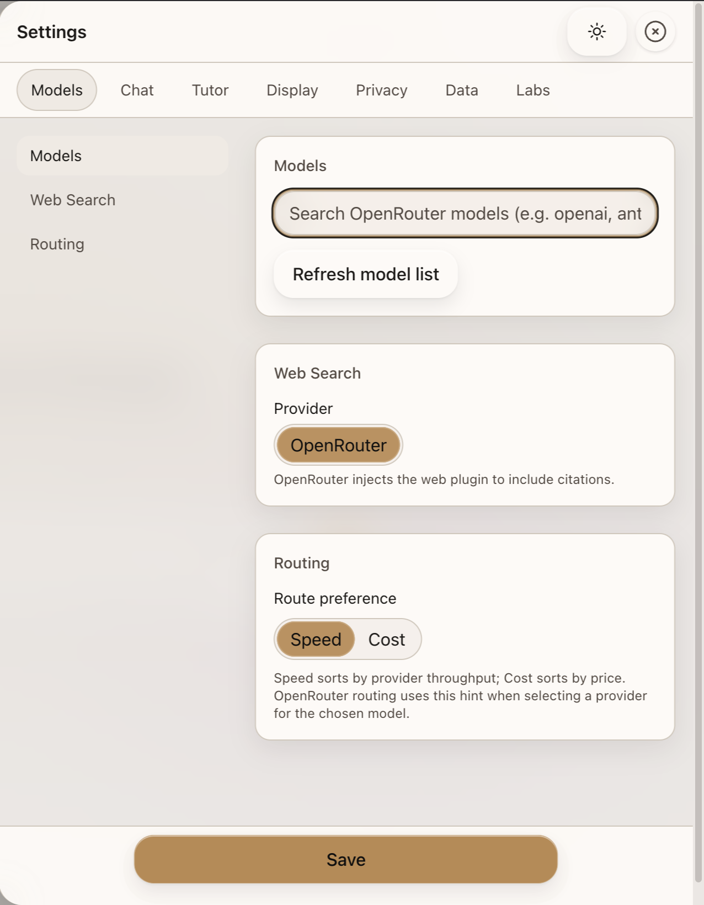

### Dialogia

Dialogia is a local-first chat UI for OpenRouter models.

### Why

- Keep prompts and history in the browser using IndexedDB
- Choose any OpenRouter model without vendor lock-in
- Simple UI with reasoning visibility and basic cost metrics

### Features

- Multi-chat sessions with rename and delete
- Folders with nested structure; drag & drop chat organization
- Model picker with curated and custom model ids
- Streaming responses with time-to-first-token and tokens per second
- Optional reasoning display for thinking models
- Compare drawer: run the same prompt across multiple models with metrics
- Optional Brave web search augmentation for source-grounded answers
- PDF attachments: attach PDFs directly (as file blocks via OpenRouter); downstream models can read them without local parsing
- Basic cost estimate when pricing metadata is available
- Local persistence via Dexie (IndexedDB)
- Privacy-first: ZDR-only model filtering (default on)

### Screenshots




### Setup

Create `.env.local` at the project root. Recommended proxy mode (keeps keys on the server):

```
# Route OpenRouter requests through Next.js API routes using a server key
NEXT_PUBLIC_USE_OR_PROXY=true
OPENROUTER_API_KEY=sk-or-v1_your_server_key_here

# Optional: Brave Search for web augmentation
BRAVE_SEARCH_API_KEY=brave_your_key_here
```

Alternatively, if you prefer client‑side requests (not recommended), set:

```
NEXT_PUBLIC_OPENROUTER_API_KEY=sk-or-v1_your_client_key_here
```

Install dependencies:

```
npm install
```

### Quickstart

Development server:

```
npm run dev
```

Build and start:

```
npm run build
npm start
```

Format and type-check:

```
npm run format
npm run lint:types
```

### Usage

1. Start the dev server
2. Open `http://localhost:3000`
3. Use the model picker in the header to select a model
4. Type in the composer and press Enter to send
5. Open Settings to adjust temperature, top_p, max_tokens, and reasoning options
6. Toggle Brave web search in the composer to ground answers with sources
7. Attach images (vision models) or PDFs in the composer; PDFs are processed to include relevant excerpts

### Architecture

- Framework: Next.js App Router with React 18
- State: Zustand with local persistence
- Storage: Dexie (IndexedDB)
- UI: lightweight CSS tokens and Tailwind v4 base
- Markdown: react-markdown with Prism, KaTeX, Mermaid

Security notes:

- Prefer server‑side proxy (`NEXT_PUBLIC_USE_OR_PROXY=true`) so API keys stay on the server.
- Avoid storing provider secrets in `NEXT_PUBLIC_*` variables whenever possible.
- The Brave Search integration runs only on the server via `/api/brave` and requires `BRAVE_SEARCH_API_KEY`.
- By default, Dialogia limits model discovery to OpenRouter providers that advertise a Zero Data
  Retention (ZDR) policy, fetched from `https://openrouter.ai/api/endpoints/zdr`. You can toggle
  this in Settings → Privacy. To change the default, set `NEXT_PUBLIC_OR_ZDR_ONLY_DEFAULT=false` in
  `.env.local`. Using an API key restricted to ZDR providers also works seamlessly.

Code tree:

```
dialogia/
  app/
    layout.tsx
    page.tsx
    globals.css
  src/
    components/
      ChatPane.tsx
      ChatSidebar.tsx
      Composer.tsx
      MessageList.tsx
      ModelPicker.tsx
      SettingsDrawer.tsx
      ThemeToggle.tsx
      TopHeader.tsx
      WelcomeHero.tsx
    data/
      presets.ts
    lib/
      crypto.ts
      db.ts
      markdown.tsx
      openrouter.ts
      store.ts
      types.ts
    types/
      prism.d.ts
  styles/
    francesco-bootstrap.css
```

### License

MIT
